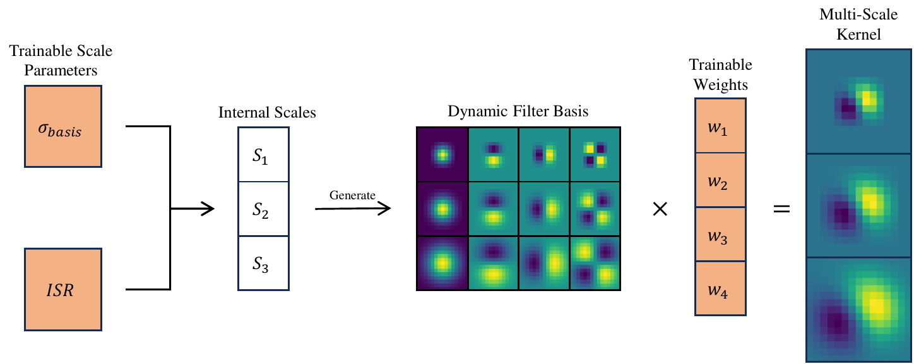

# Scale Learning in Scale-Equivariant Convolutional Networks

### Abstract
In real-life scenarios, there are many variations in sizes of objects of the same category and the objects are not always placed at a fixed distance from the camera. This results in objects taking up an arbitrary size of pixels in the image. Vanilla CNNs are by design only translation equivariant and thus have to learn separate filters for scaled variants of the same objects. Recently, scale-equivariant approaches have been developed that share features across a set of pre-determined fixed scales. We further refer to this set of scales as the internal scales. Existing work gives little information about how to best choose the internal scales when the underlying distribution of sizes, or scale distribution, in the dataset, is known. In this work, we develop a model of how the features at different internal scales are used for samples containing differently-sized objects. The proposed model return comparable internal scales to the best-performing internal scales for different data scale distribution of various width. However, in most cases, the scale distribution is not known. Compared to previous scale-equivariant methods, we do not treat the internal scales as a fixed set but directly optimise them with regard to the loss, removing the need for prior knowledge about the data scale distribution. We parameterise the internal scales by the smallest scale which we refer to as σbasis, and the Internal Scale Range (ISR) that models the ratio between the smallest and largest scale. By varying the ISR, we learn the range of the scales the model is equivariant to. We show that our method can learn the internal scales on various data scale distributions and can better adapt the internal scales than other parameterisations. Finally, we compare our scale learning approach and other parameterisations to current State-of-the-art scale-equivariant approaches on the MNIST-Scale dataset.



## Repository Structure

This repository is organized as follows:

- Code to generate the static dataset and baseline MNIST-Scale can be found in `Data`
- All other code can be found in `src`
  - `src/configs` contains the default configurations files for MNIST-Scale and STL-10 experiments respectively, with `main_config.yaml` containing more general setup options
  - `src/disco` contains fixed and learnable scale version of SESN and other basis variants including DISCO (not learnable)  
  - `src/utils` contains helper functions used for data loading, model configuration etc. 
  - `src/experiments` contains commands to replicate the experiments from the paper

## Installation

#### Conda (recommended)

In order to reproduce our results, please first install the required dependencies. This can be done by:

```
conda env create -f environment.yaml
```


This will create a conda environment named `scale-equivariant-learn-cnn` with all the required dependencies. *Note that this yaml file is configured for linux*

## Usage

Multi-Layer image classification runs to compare with other baselines are run with `src/train_lightning.py` while other experiments are run with `scale_learn.py`. Both training files make use of the Pytorch Lightning to power the training logic (including Multi-GPU training). Experiments with different setups are run using `run_exp.py` and `scale_learn_sweep.py` respectively which are both wrappers around the training files.

More info on commands and reproduction of the results can be found in `src/experiments`. 

Flags are handled by [Hydra](https://hydra.cc/docs/intro). See `src/configs` for all available flags. Flags can be passed as `xxx.yyy=value`.

